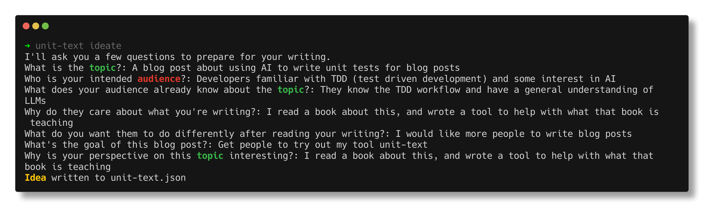
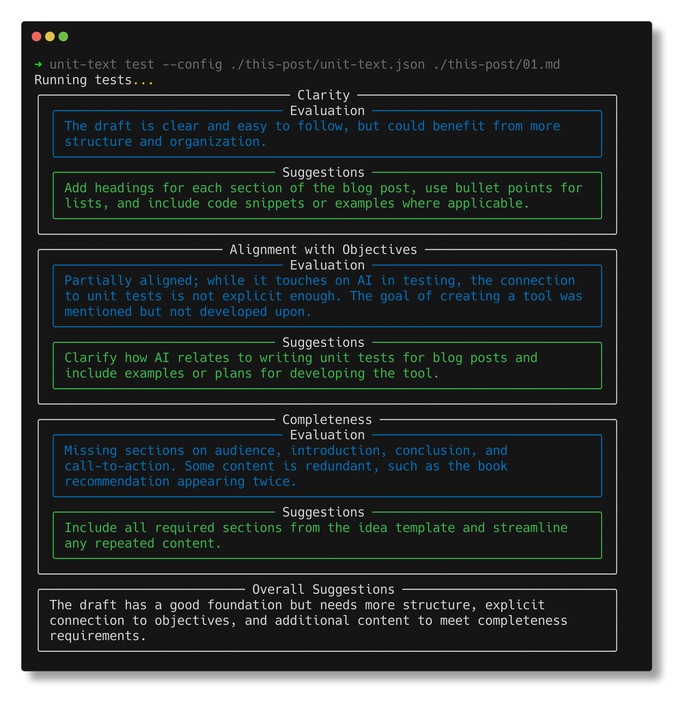
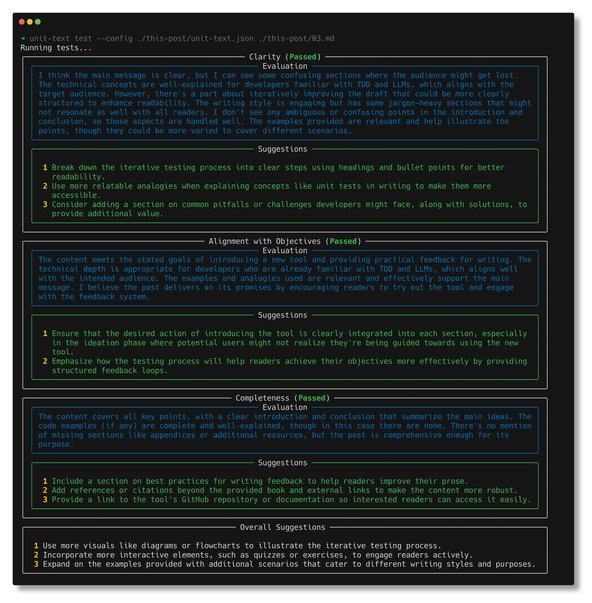

# This blog post passed unit tests

I'm reading a book called "Writing for Developers",[^1]
which has some great advice on writing blog posts that get read.

With this post, I have 2 objectives:

- put in practice what I'm learning from this book;
- introduce a tool[^3] I created to motivate me to write this post (and hopefully many more in the future!).

I hope this tool will motivate you to write more, too!

## Writing with LLMs

In the past couple of years, we all experienced that weird feeling when reading something that likely came out
of a large language model (LLM). Even those models can detect prose written by other models...
This is not an anti-LLM rant though; I believe they are a marvelous tool, and used wisely they can give us superpowers.
Writing original content is not where they shine though. You may be writing about the most novel ideas,
but if presented by an LLM, nobody is going to give them credit.

Or alternatively, for all of us who are not publishing breakthrough research, we could very well write posts
about something that's already well known, as long as we do it to share our personal experience,
bring some personality into it; and how else could we do it rather than through our own voice.

### LLMs as reviewers

Going back to the book,[^1] I greatly appreciated how they touch on the topic of AI: throughout the book,
various example prompts are presented to help refine and get feedback on what was written.
Appendix B: "AI uses and abuses" then offers very concrete ways to use LLMs wisely, above all, to _criticise_.

## On human feedback

At some point, some human has to read what you wrote
(remember the premise: we are writing _blog posts that get read_, hopefully by more humans than machines).
And hopefully, the first one to read your writing will be "a helpful assistant", 😉
giving objective, transparent feedback, and possibly some actionable items.

- Is the post consistent, or did I veer away from the topic?
- Is there any logical fallacy? Anything I should add (or remove)?
- Did I meet the goal I had when I started writing?

## The process

There should be some preparation before we start writing:

- have an idea, and a personal perspective on it;
- think about your audience, what do they know, what do you want to tell them;
- write down an objective.

If you want to do this properly, I still encourage you to read the book[^1]
(I'm not affiliated: I just liked it very much).

With that prep work done, we can finally start iterating on our "working draft".

Back when I was at school, when we still ~wrote with a quill~
(no I'm not that old, although our desks did have a slot to place the inkwell...)
wrote with pen and paper, I always went straight to "fair copy".
In Italian, we have a very poor way of naming drafts:
_brutta_ (_ugly_, literally) and _bella copia_ (_pretty_)
to distinguish the _working_ and _final draft_ respectively.
Why would you want to do something ugly? I think this may have been the origin of it...

I thought I was very smart and saved plenty of time (and a fine sheet of paper),
until I tried out the alternative, and realised I was very dumb,
and could in fact produce much better content when iterating on it, in a safe space.
Nobody would see the _ugly_ draft - and thinking about it now, even if they did, so what?
The amount of time required would also not change. I have also since learned that tasks expand or shrink
to take up whatever time you have available.

Sometimes I realise I still struggle with this though: more specifically, when writing code.
Before getting started, I think a lot, it's even worse when I have no clear deadline since the task
can now expand indefinitely. I do a lot of research on what tools I could use, what's the prior art,
how should I structure my code...[^2]

But I always forget, I can have a _working draft_! I can start writing shitty code, and get some feedback.
I can even throw it all away and start again, and be ready to publish the moment **I meet my goal**.

There are interesting analogies and differences between writing code and prose.
Maybe it's a topic for another blog post. But for now, I want to focus on this last one analogy:

When I start writing code, I have an **objective** (I want to solve a problem), and I am coming up with a process,
a user experience, to get there, to solve the problem. When writing a blog post, I have an **objective**,
a message I want to give to my audience, and I'm coming up with words in the right order to make that message clear.

When making software, those expectations, the **objective**, can be encoded, in the form of tests.
And now I'm thinking, why can't we do the same with prose?

## Test-driven blogging

Testing is an important part of modern programming, it's one of the best ways to avoid getting stuck, getting lost,
or losing track of the core features.

I particularly appreciate TDD when I need to take a break:
when I come back (if I have tests) I can start right where I left.
Without tests, sometimes I spend hours trying to remember WTF I was trying to do...

And now I'm thinking I'd like something similar for writing:
sometimes I feel inspired and words just flow, I know I can come back later to do some "refactoring",
I will iterate on my working draft, and make it sound more natural.

But the real point is, once I'm done, did I meet my objective?
After all, I wanted to write a _blog post that gets read_.
I want to get feedback out of it, some interesting ideas... yeah I don't believe that much in "writing for yourself",
sure it can be a way to organise my thoughts, but then why not just write a diary? Clearly, if I publish something,
it's because I think it may have some value for somebody else, and I would love to maybe start a discussion from it.

## `unit-text`

If I'm testing Python code, I'll just grab `pytest`.
How to test prose? Why, just ask ChatGPT of course!

Of course I wrote a GPT wrapper, what else? If you say you can just copy-paste your Markdown into ChatGPT
and prompt it yourself, you'd be right, and I'm not trying to stop you.

Just as you can keep testing code in your shell and looking at Excel to see if you got the right result.
Some people are very successful that way, and I won't judge them.

This won't replace human review either: this is for humans writing for humans.
While AI can tell if something was written by another AI,
it won't know if something written by a human stirred some emotions (at least for now).

But it can be a powerful tool to help you get started, keep things on track, and get continuous, practical feedback.

### Ideation

Before using it, we need to have an idea. `unit-text ideate` will guide you with the right questions,
and save this locally, so you can keep looking at it while writing.

In fact, you may even iterate on the idea itself as you research and discover new facts!

### Writing: the human touch

This is for you! Just put some words down, you'll keep getting to them.
Don't worry about writing a masterpiece right now!

If you don't know what to do here, I should probably refer you back to the book.[^1]

### Testing: read, criticise, improve

[//]: # "TODO Think about how to link the various versions of the post"

When you've done some progress, run some tests!

I currently wrote 3 iterations of this blog post:

#### First iteration

#### Final version

I keep doing this until I get a "green light" ✅ - now I feel I can publish!
(Or at least, share it with a human)

### What's next

Not all blogs are technical blogs, and not all prose is a blog either.
Different contexts require a different style and structure; before you start writing,
you probably ask yourself different questions.

Just as we have unit, integration, end-to-end, fuzz, property, (insert-your-own) testing for code,
we could offer different, pre-packaged strategies for different types of prose;
asking some other questions during the "ideation" phase, and returning feedback in a dedicated structure.

The ideation phase could be expanded further: right now the set of questions is pre-defined,
but AI could already play a role here, asking more questions if something is lacking some details.

These are just some of the ideas I intend to work on next:

- **Interactive ideation**: Right now the tool only asks some pre-defined questions.
  It delegates the entire thinking process to the writer. However, with a dedicated agent,
  the tool could prompt the writer to dive deeper explaining the idea further,
  and clarifying any open points or loopholes before they start writing.
- **Autonomous research**: At some point during the ideation phase, knowing about prior art
  can be particularly valuable. Here, a search agent could help, possibly also storing and indexing
  other articles that may then be referenced.
- **API and integrations**: I built the CLI as a proof of concept, however, making this tool into an
  API could make it usable from other platforms, too.
- **Additional blueprints**: Different types of written content would demand different prompts
  and configurations. I'd like to do a version for Git repos README files next!

[^1]:
    [Sarna, P., & Dunlop, C. (2024). _Writing for Developers: Blogs that get
    read_, Manning Publications Co.](https://www.manning.com/books/writing-for-developers)

[^2]:
    [_I think I'm thinking too much_ | Sealambda](https://www.sealambda.com/blog/stop-overthinking/)
    by [Iván Peña](https://www.sealambda.com/authors/ivan)

[^3]: [unit-text](http://github.com/sealambda/unit-text) - unit tests for plain text
